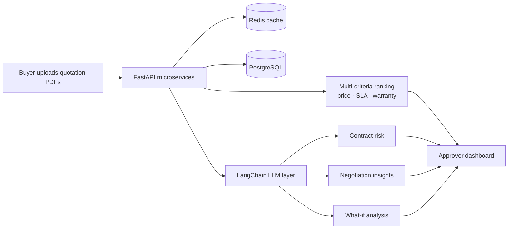

  

  

  
  
  
  

  
  
  

---

## ⚡ 30-SECOND RECRUITER SCAN

| 🎯 Target roles | 🧠 Core strengths | 📍 Education |
|---|---|---|
| **AI/ML Engineer** · **Data Analyst** | RAG pipelines · LLM agents · MLOps · FastAPI backends · Fraud/risk analytics | B.Tech CSE, **KIET Group of Institutions** (2024–2028) · CGPA **8.3** |

### 💥 Impact in numbers

<table align="center">
<tr>
<td align="center"><h2>94%</h2>fraud recall on <b>0.16%</b> fraud-rate data</td>
<td align="center"><h2>100+</h2>production users on ProcureMind AI</td>
<td align="center"><h2>Top 200</h2>of <b>10,000+</b> HCLTech AIthon</td>
<td align="center"><h2>Top 3</h2>across KIET Group at AIthon</td>
<td align="center"><h2>200+</h2>DSA problems on LeetCode</td>
</tr>
</table>

### 🧪 Experience

| Role | Company | When | What I shipped |
|---|---|---|---|
| **Machine Learning Intern** | FlyRank Corp. | Jul–Sep 2026 | Production MLOps pipelines for **ProcureMind AI**: multi-source ingestion, automated feature engineering, continuous training; 100+ users with controlled API latency |
| **AI & Data Analyst Intern** | Xylofy AI | Apr–Jun 2026 | **FraudGuard AI**: SMOTE + XGBoost engine, async Flask APIs, batch inference, real-time SHAP dashboard |

---

## 🏆 Achievements

### 🎖️ GitHub Achievements

  
  &nbsp;&nbsp;&nbsp;&nbsp;&nbsp;
  

<b>🤠 Quickdraw</b> · closed an issue/PR within 5 minutes &nbsp;|&nbsp; <b>🦈 Pull Shark</b> · merged pull requests

### 🌟 Competitions & Certifications

| 🏅 | Milestone |
|:-:|---|
| 🥇 | **HCLTech AIthon**: Top 200 of 10,000+ nationwide · **Top 3 at KIET Group** |
| 🇮🇳 | **Smart India Hackathon 2026**: qualified institutional round → **shortlisted for national screening** (NCRB / MHA track) |
| ☁️ | **AWS Certified Cloud Practitioner** |
| 🎓 | Oracle SQL Database · Red Hat Linux Fundamentals · Deloitte Simulation |

---

## 🚀 Featured Projects

<table>
<tr>
<td width="50%" valign="top">

### 🏢 ProcureMind AI
**B2B procurement intelligence · 100+ users**

Ranks vendor quotes on price, SLA & warranties, then uses LLMs for contract-risk scoring, negotiation insights and what-if analysis.

`FastAPI` `React` `PostgreSQL` `Redis` `LangChain`

JWT RBAC (Buyer/Approver/Admin) · Redis-cached PDF parsing · pooled DB connections

[🌐 Frontend](https://procurewise-insight.onrender.com/) · [⚙️ Backend](https://procuremind-ai-backend.onrender.com/) · [📂 FE](https://github.com/KAVINGUPTA09/procurewise-insight) · [📂 BE](https://github.com/KAVINGUPTA09/procuremind-ai-backend)

</td>
<td width="50%" valign="top">

### ⚖️ Tathya · SIH 2026
**Tamper-evident evidence platform**

Permission-aware bilingual RAG search across 5 institutional roles. Evidence integrity via SHA-256 + three-way hash verification anchored on a local Ethereum ledger.

`FastAPI` `Next.js` `pgvector` `MinIO` `Solidity` `OCR`

[🎥 Video](https://acesse.one/uqct63w) · [📂 Repo](https://github.com/KAVINGUPTA09/TATHYA--sih26-KAVINGUPTA09)

</td>
</tr>
<tr>
<td width="50%" valign="top">

### 🛡️ FraudGuard AI
**94% recall · 0.16% fraud rate**

SMOTE + XGBoost on brutally imbalanced data, async REST APIs with batch inference, live SHAP explainability dashboard.

`XGBoost` `SMOTE` `Flask` `Streamlit` `SHAP`

[🌐 Frontend](https://fraud-detection-dashboard-54hq.onrender.com/) · [⚙️ Backend](https://mlproject-1eie.onrender.com/) · [📂 Repo](https://github.com/KAVINGUPTA09/MLPROJECT-)

</td>
<td width="50%" valign="top">

### 🎬 InsightTube v3.3
**Long video → executive brief**

Autonomous agent producing briefs, action checklists, takeaways and timestamped chapters. Exports to PDF/Markdown.

`Agno` `Llama 3.3` `Groq` `SQLite` `Streamlit`

[🚀 Live Demo](https://youtube-link-analyzer-using-agno-agents-erggp6b3gxgxtb8xn9dz2n.streamlit.app/) · [📂 Repo](https://github.com/KAVINGUPTA09/YOUTUBE-LINK-ANALYZER-USING-AGNO-AGENTS)

</td>
</tr>
<tr>
<td colspan="2" valign="top">

### ❤️ Heart Disease Analytics Engine
Clinical analytics pipeline mapping cardiovascular risk correlations across patient biomarkers, with interactive Tableau dashboards. `Python` `Scikit-learn` `Tableau`
[🚀 Live Demo](https://heartdisease-da-1.onrender.com/) · [📂 Repo](https://github.com/KAVINGUPTA09/HeartDisease_DA)

</td>
</tr>
</table>

### 🧬 How ProcureMind AI works

---

## 🛠️ Tech Arsenal

  

  
  
  
  
  
  
  
  
  
  
  
  
  
  
  
  

**Core CS:** Data Structures & Algorithms · OOP · DBMS · System Design · Operating Systems

---

## 📊 GitHub Analytics

  
  

  

  

---

## 📬 Let's talk

  

  
  

  

  

