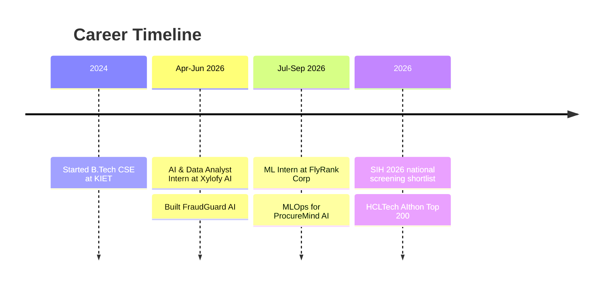
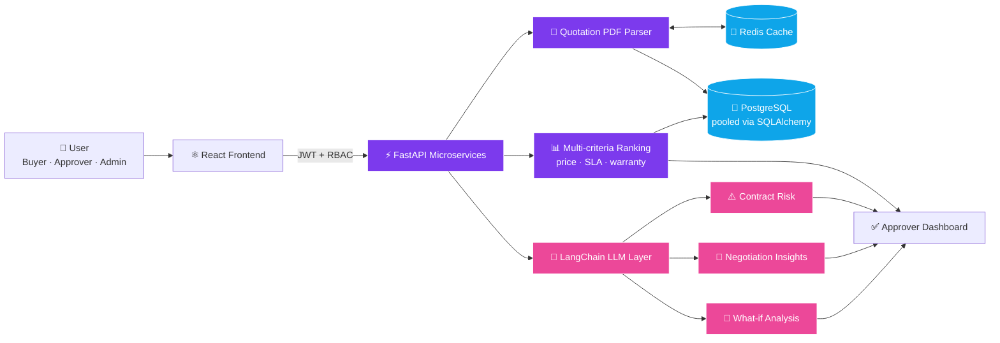
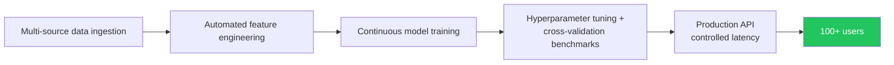
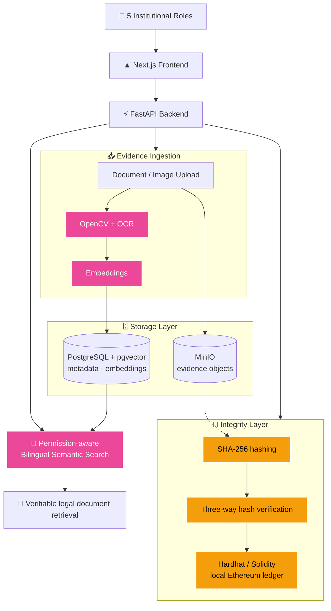
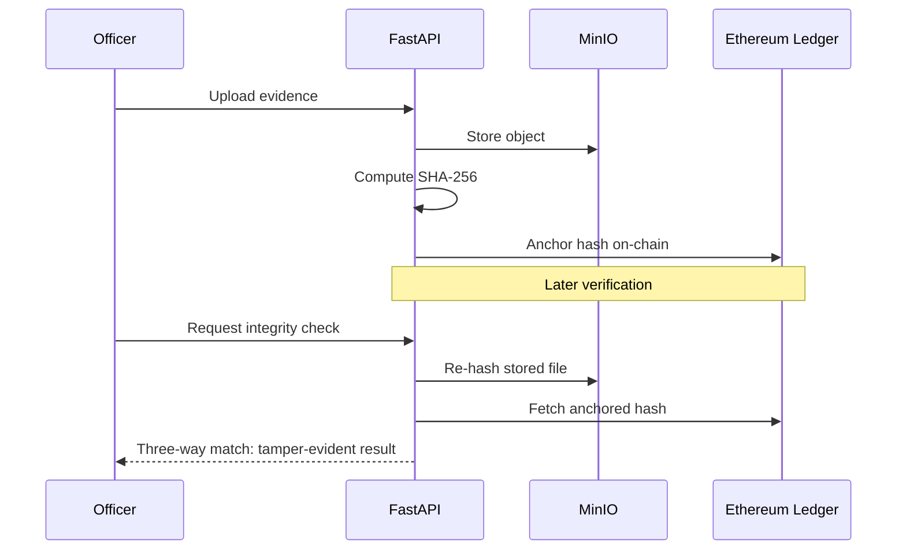
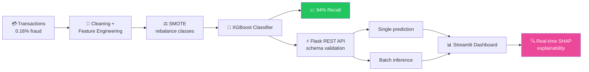
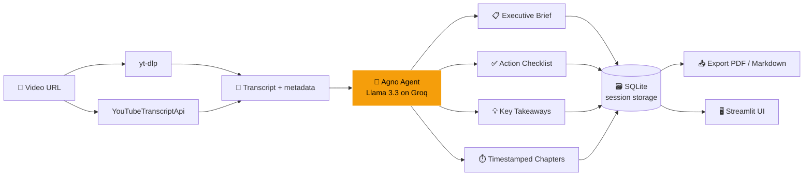
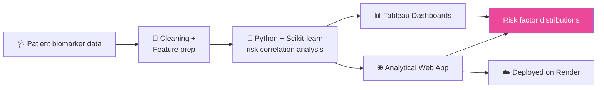
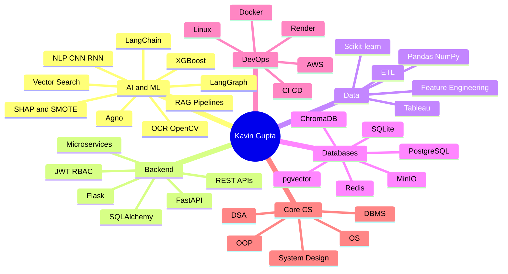

  

  

  
  
  
  

  
  
  

---

## ⚡ 30-SECOND RECRUITER SCAN

| 🎯 Target roles | 🧠 Core strengths | 🎓 Education |
|---|---|---|
| **AI/ML Engineer** · **Data Analyst** | RAG pipelines · LLM agents · MLOps · FastAPI backends · Fraud/risk analytics | B.Tech CSE, **KIET Group of Institutions** (2024–2028) · CGPA **8.3** |

<table align="center">
<tr>
<td align="center"><h2>94%</h2>fraud recall on <b>0.16%</b> fraud-rate data</td>
<td align="center"><h2>100+</h2>production users on ProcureMind AI</td>
<td align="center"><h2>Top 200</h2>of <b>10,000+</b> HCLTech AIthon</td>
<td align="center"><h2>Top 3</h2>across KIET Group at AIthon</td>
<td align="center"><h2>200+</h2>DSA problems on LeetCode</td>
</tr>
</table>

---

## 🧪 Experience

| Role | Company | When | What I shipped |
|---|---|---|---|
| **Machine Learning Intern** | FlyRank Corp. | Jul–Sep 2026 | Production MLOps pipelines for **ProcureMind AI**: multi-source ingestion, automated feature engineering, continuous model training. 100+ users with controlled API latency; hyperparameter tuning and cross-validation benchmarks |
| **AI & Data Analyst Intern** | Xylofy AI | Apr–Jun 2026 | **FraudGuard AI**: SMOTE + XGBoost engine, async Flask APIs with schema validation, batch inference, real-time SHAP dashboard |

---

## 🏆 Achievements

### 🎖️ GitHub Achievements

  
  &nbsp;&nbsp;&nbsp;&nbsp;&nbsp;
  

<b>🤠 Quickdraw</b> · closed an issue/PR within 5 minutes &nbsp;|&nbsp; <b>🦈 Pull Shark</b> · merged pull requests

### 🌟 Competitions & Certifications

| 🏅 | Milestone |
|:-:|---|
| 🥇 | **HCLTech AIthon**: Top 200 of 10,000+ nationwide · **Top 3 at KIET Group** |
| 🇮🇳 | **Smart India Hackathon 2026**: qualified institutional round, **shortlisted for national screening** (NCRB / MHA track) |
| ☁️ | **AWS Certified Cloud Practitioner** |
| 🎓 | Oracle SQL Database · Red Hat Linux Fundamentals · Deloitte Simulation |

---

## 🚀 Projects (deep dive)

  
  
  
  
  

 

<!-- ======================= PROCUREMIND ======================= -->
## 🏢 ProcureMind AI

> Ranks vendor quotations on price, SLA compliance and warranties, then uses LLMs for contract-risk assessment, negotiation insights and what-if analysis. **Serves 100+ users in production.**

**System architecture**

**MLOps layer (FlyRank Corp.)**

| Highlight | Detail |
|---|---|
| 🔐 Security | JWT-based RBAC across Buyer, Approver and Admin tiers |
| ⚡ Performance | High-concurrency FastAPI, PostgreSQL connection pooling, Redis caching |
| 🧠 AI | Automated contract risk, negotiation insights, what-if scenarios |

  
  
  
  

---

<!-- ======================= TATHYA ======================= -->
## ⚖️ Tathya · SIH 2026

> Tamper-evident platform for legal case and evidence management, with a RAG layer for permission-aware bilingual semantic search. Smart India Hackathon 2026 · PS **SIH26190** · Team **Binary Brains** · NCRB / MHA track.

**System architecture**

**Evidence verification flow**

| Highlight | Detail |
|---|---|
| 🧠 RAG | OpenCV/OCR ingestion, pgvector embeddings, bilingual semantic search |
| 🔐 Access control | Permission-aware retrieval across 5 institutional roles |
| ⛓️ Integrity | SHA-256 and three-way hash verification anchored on a local Ethereum ledger |

  
  

---

<!-- ======================= FRAUDGUARD ======================= -->
## 🛡️ FraudGuard AI

> End-to-end data pipeline and classification engine on heavily skewed transactions (**0.16% fraud**), using SMOTE + XGBoost to reach **94% recall**, with real-time SHAP explainability.

| Metric | Value |
|---|---|
| Fraud rate in data | **0.16%** |
| Fraud recall | **94%** |
| Serving | Asynchronous Flask REST APIs, schema validation, batch inference |
| Explainability | Real-time SHAP in Streamlit |

  
  
  

---

<!-- ======================= INSIGHTTUBE ======================= -->
## 🎬 InsightTube v3.3

> Autonomous AI engine that converts long-form videos into decision-ready executive briefs, action checklists and takeaways, with timestamped chapter navigation.

| Highlight | Detail |
|---|---|
| 🧭 Navigation | Chronological event mapping with timestamped chapters |
| 🛡️ Resilience | yt-dlp + YouTubeTranscriptApi extraction pipeline |
| 💾 Persistence | SQLite sessions, exportable PDF / Markdown summaries |

  
  

---

<!-- ======================= HEART DISEASE ======================= -->
## ❤️ Heart Disease Analytics Engine

> End-to-end clinical data analytics pipeline identifying cardiovascular risk correlations across multi-variable patient biomarkers, presented through interactive Tableau dashboards.

  
  

---

## 🧠 Skills Map

  

---

## 📊 GitHub Analytics

  
  

  

  

---

## 📬 Let's talk

  

  
  

  

  

